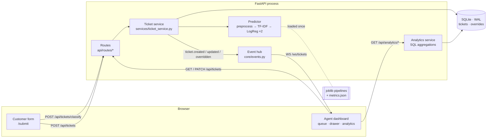

# Architecture

TriageAI is a FastAPI service with an embedded scikit-learn model, a SQLite
store, and a React dashboard that stays in sync over a WebSocket. One process
serves the API, runs inference, and fans out live events. Nothing talks to an
external AI API.

## A ticket's journey

1. **Preview.** The customer form posts to `POST /api/tickets/classify`. The
   same predictor runs, nothing is stored, and the form shows the category,
   urgency, both probability distributions and the phrases that drove them.
2. **Submit.** `POST /api/tickets` validates the payload with Pydantic, then
   `ticket_service.create_ticket` scores `subject + body` *before* writing the
   row, so a ticket never exists unclassified. Inference is a few milliseconds
   on CPU, which is why it runs inline rather than on a queue.
3. **Predict.** `app/ml/predictor.py` passes the text through the shared
   `preprocess()` (one implementation for training and serving, so they cannot
   drift) and two independent pipelines: category and urgency. Each returns a
   ranked distribution, per-term contributions read off the linear model, and a
   `needs_review` flag when confidence falls below 0.55 (category) or 0.45
   (urgency).
4. **Store.** The row keeps the *current* labels and, separately, the model's
   original `ai_*` labels and scores. Those are never mutated.
5. **Broadcast.** The route hands a compact summary to the event hub, which
   JSON-encodes it once and sends it to every connected dashboard.
6. **Render.** `FeedContext` patches the cached board in place, so the card
   slides into the Open column with no refetch. A Critical ticket also raises a
   toast.
7. **Act.** An agent drags the card or changes a label in the slide-over.
   `PATCH /api/tickets/{id}` updates the ticket and appends an `overrides` row
   for any label change, recording what the model said and how confident it
   was. The UI updates optimistically and rolls back if the request fails.
8. **Measure.** `GET /api/analytics/summary` aggregates volume, distributions,
   SLA breaches, resolution times and override reliability in SQL.
   `GET /api/analytics/model` serves the offline evaluation straight from
   `metrics.json`, so the dashboard shows exactly what training measured.

## Data model

| Table | Holds | Notes |
|---|---|---|
| `tickets` | subject, body, requester, status, current `category`/`urgency`, the model's `ai_*` labels, confidences, score distributions and rationales (JSON), SLA timestamps | Indexed for the board's status + recency query |
| `overrides` | ticket, field, `from_value` → `to_value`, model confidence and version, timestamp | Append-only; the live reliability signal and future training data |

## Real-time contract

`WS /ws/tickets` is push-only. On connect the server sends `ready`, then:

| Event | Payload | Client effect |
|---|---|---|
| `ticket.created` | ticket summary | Insert into the board cache, highlight, toast if Critical |
| `ticket.updated` | ticket summary | Replace in cache, invalidate its detail |
| `ticket.overridden` | ticket summary | Same, plus refresh analytics |
| `stats.invalidated` | `{deleted_id}` | Refetch board and analytics |
| `ping` | — | Keepalive every 25s so proxies don't drop idle sockets |

If the socket drops, the client reconnects with jittered exponential backoff,
polls every 8s in the meantime, and refetches once reconnected, because events
that fired during the gap were never delivered.

## Decisions worth defending

- **SQLite, not MongoDB.** The workload is relational and aggregate-heavy
  (GROUP BY for every chart), and a zero-service store keeps clone-and-run
  honest. Persistence sits behind a service layer, so swapping stores touches
  one module.
- **Two classifiers, not one 24-class model.** Each learns from the whole
  dataset instead of starving rare category × urgency combinations.
- **Logistic regression over a linear SVM.** Similar macro F1, but it yields
  calibrated probabilities (the confidence bars and review threshold depend on
  them) and coefficients that explain each prediction.
- **Selective prediction.** The model routes what it is sure about and flags
  the rest. The threshold was chosen from a measured coverage/accuracy curve,
  and a smarter-sounding alternative was rejected on the numbers (see
  `MODEL.md`).
- **Keep the model's original answer.** Agent corrections are free ground
  truth; storing only the current label would throw away the one metric that
  keeps updating after deployment.
- **WebSocket with a polling fallback.** Live arrival is the product claim, and
  a 10s poll makes it untrue exactly when a Critical ticket lands.
- **Encode once, then send.** Broadcast payloads are serialised before any
  socket send. When a datetime once failed inside each send, every client was
  silently dropped as "disconnected" — the ordering keeps a bad payload from
  masquerading as a network error.

## Known limits and the next step for each

| Limit | Why it's fine today | Next step |
|---|---|---|
| No authentication; the API is public | Local demo with synthetic data | SSO in front of the dashboard (e.g. an identity-aware proxy) |
| Event hub is per-process | One uvicorn worker | Redis pub/sub between workers |
| SQLite, schema via `create_all` | Single instance, no data to migrate | Postgres + Alembic migrations |
| Trained on synthetic tickets | No labelled real-world corpus exists | Retrain periodically on the `overrides` log |
| Thresholds read off one held-out set | Documented in `MODEL.md` | Re-derive from live override data |
