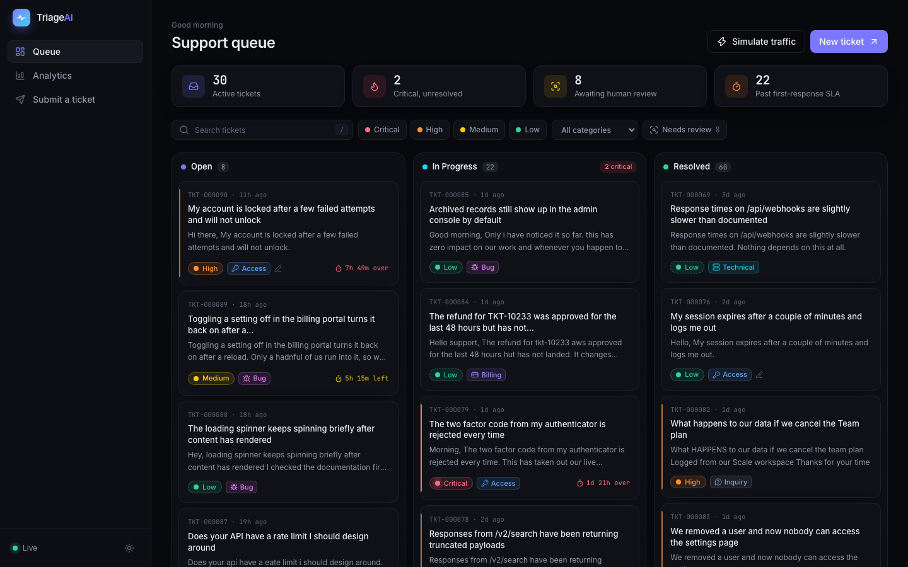
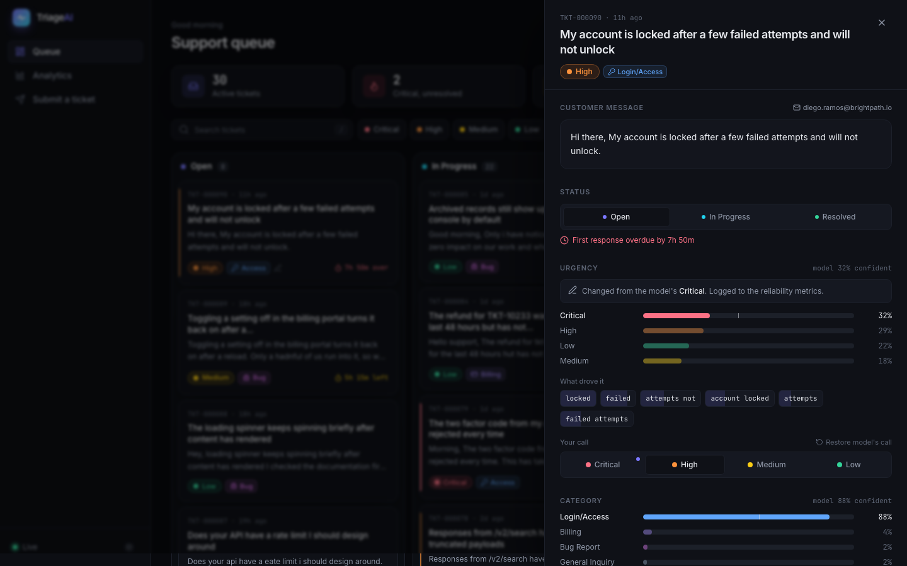
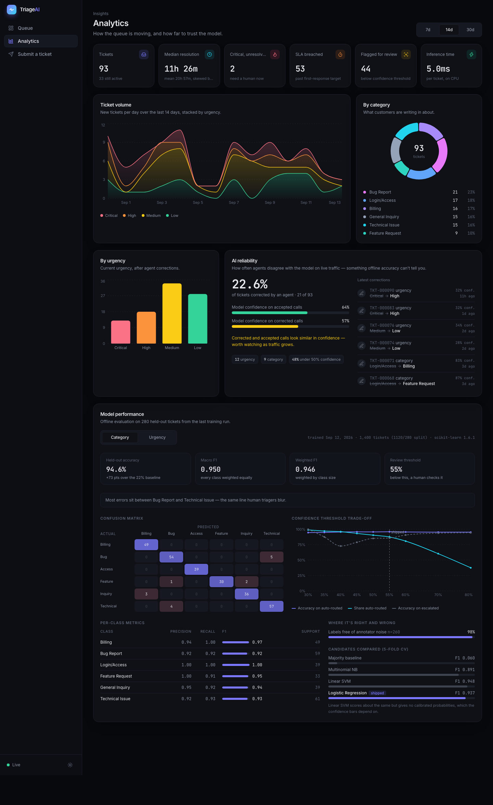
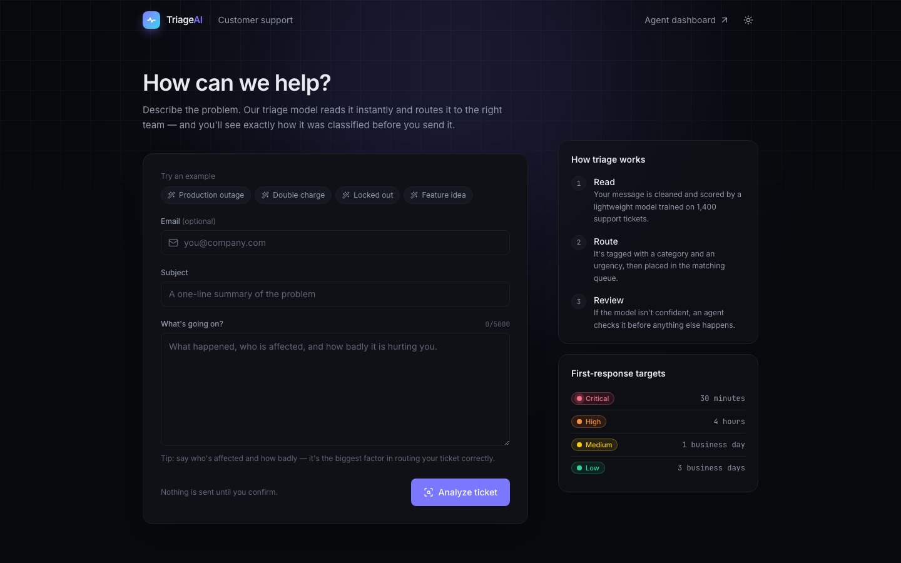
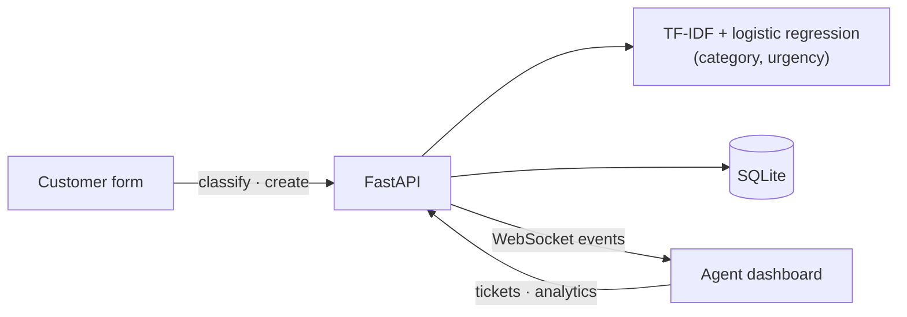

# TriageAI

**Support tickets, classified and routed the moment they arrive, with the model's confidence and reasoning in plain view.**

TriageAI reads each incoming support ticket, predicts **what it's about** (six categories) and **how urgent it is** (four levels), and drops it into a live Kanban queue. When the model isn't sure, it says so and flags the ticket for a human rather than routing it blindly. Every agent correction is logged, and that log becomes a live measure of how far to trust the model.



---

## The problem

Support teams spend the first minutes of every ticket just reading and sorting it: is this billing or a bug, and does it need someone now or next week? That work is repetitive, and when it's slow a Critical outage waits behind a feature request.

Automating it is only useful if agents can trust the result. So TriageAI is built around three things a black-box model doesn't give you:

- **Confidence you can act on.** Predictions below a measured threshold are flagged for review instead of silently routed.
- **Reasons, not just labels.** Every call shows the phrases that drove it ("losing revenue", "invoice", "locked out").
- **A reliability signal that keeps updating.** Offline accuracy is a snapshot. The override rate, and whether overrides land on the calls the model was unsure about, tracks real traffic.

## Results

Evaluated on 280 held-out tickets. Full write-up in [MODEL.md](MODEL.md).

| | Category | Urgency |
|---|---|---|
| Accuracy | **94.6%** (baseline 21.8%) | **73.2%** (baseline 31.1%) |
| Macro F1 | 0.950 | 0.728 |
| Within one severity level | — | **94.3%** |
| When the customer states their impact | — | 90.8% |
| When they don't | — | 39.0% |

The urgency split is the headline finding. The model is strong when a ticket says how bad things are and honestly uncertain when it doesn't, which pointed to a product fix rather than a bigger model: the ticket form now asks customers who's affected and how badly.

> The first version of the dataset scored **100%** on both models. That exposed template leakage in the synthetic data, not a good model. The generator was rebuilt with compositional phrasing, tickets that never state their urgency, and realistic labelling noise. The story is in [MODEL.md](MODEL.md).

## Features

**Queue.** A drag-and-drop Kanban board (Open → In Progress → Resolved) where new tickets slide in live over a WebSocket, Critical ones pulse, and SLA countdowns turn red when they're breached. Search with `/`, filter by urgency, category or "needs review". Low-confidence predictions get a quiet dashed badge instead of an alarm.

**Ticket detail.** A slide-over with the full message, both probability distributions drawn against the review threshold, the phrases behind each prediction, one-click override with "restore model's call", and the correction history.



**Analytics.** Volume over time stacked by urgency, category and urgency distributions, median and mean resolution time, SLA breaches, and an AI reliability panel. The model performance panel renders the training run's own metrics: a confusion matrix, the confidence-threshold trade-off with the shipped operating point, per-class scores, and the candidate models that were compared.



**Customer form.** Customers describe the problem, click Analyze, and see how it will be routed, with confidence and reasoning, before they submit. One-click examples make it easy to demo.



Plus: dark mode by default with a light theme, self-hosted fonts (no network calls at runtime), skeleton loading states, toasts, reduced-motion support, keyboard-accessible drag and drop, and a traffic simulator that injects realistic tickets so the live feed has something to show.

## Architecture



Tickets are classified inline in a few milliseconds before they're stored, broadcast to connected dashboards, and patched straight into the client cache. [ARCHITECTURE.md](ARCHITECTURE.md) walks a ticket from submission to dashboard and covers the data model, the event contract, and the known limits.

## Tech stack

| Layer | Choice | Why |
|---|---|---|
| API | FastAPI, Pydantic v2 | Async, typed request validation, OpenAPI docs for free |
| Model | scikit-learn: TF-IDF + logistic regression | Fast on CPU, explainable per prediction, calibrated probabilities for the confidence UI |
| Storage | SQLite (async SQLAlchemy 2.0, WAL) | Relational, aggregate-heavy data with zero services to run; isolated behind a service layer |
| Realtime | Native FastAPI WebSockets | One-way fan-out needs no Socket.IO; clients fall back to polling |
| Frontend | React 19, TypeScript, Vite | Strict types end to end, fast builds, lazy-loaded routes |
| UI | Tailwind CSS v4, Framer Motion, Recharts, dnd-kit | Token-based theming, purposeful motion, accessible drag and drop |
| Data fetching | TanStack Query | Caching, optimistic updates with rollback, cache patching from socket events |

## Running it locally

**Requirements:** Python 3.11+ and Node.js 20.19+ (or 22.12+).

```bash
make install   # backend venv + pip install, frontend npm ci
make seed      # 90 demo tickets spread over the last two weeks
make api       # http://localhost:8000  (docs at /docs)
make web       # http://localhost:5173  (in a second terminal)
```

The trained model is committed, so there's no training step. There's also no login: the dashboard opens straight into the queue. Open **Submit a ticket** in a new tab to watch it land on the board, or click **Simulate traffic**.

<details>
<summary>Without make</summary>

```bash
cd backend
python3 -m venv .venv && .venv/bin/pip install -r requirements-dev.txt
.venv/bin/python -m scripts.seed --n 90 --reset
.venv/bin/uvicorn app.main:app --reload --port 8000

cd frontend
npm ci && npm run dev
```
</details>

**With Docker:** `make up` builds both images and serves the app at http://localhost:8080 and the API docs at http://localhost:8000/docs. nginx proxies `/api` and `/ws`, so it all runs same-origin.

### Retraining the model

```bash
make dataset   # regenerate the 1,400-ticket corpus (seed 42, reproducible)
make train     # model selection, grid search, evaluation → app/ml/artifacts/
```

### Tests

```bash
make test      # 41 backend tests: preprocessing, model contract, generator, API, WebSocket
make lint      # ruff + TypeScript type-check
```

## Deploying

The repo ships with configs for a split deployment. Neither is deployed yet.

**API on Railway.** Create a service from the `backend/` directory (it picks up `railway.json` and the Dockerfile). Attach a volume at `/data` so the SQLite file survives redeploys, and set `CORS_ORIGINS` to the frontend's URL (comma-separated if there's more than one). Keep one replica, because the live-event hub is in-process.

**Frontend on Vercel.** Import the repo with `frontend/` as the root directory (`vercel.json` handles SPA routing and asset caching), and set `VITE_API_URL` to the Railway URL before building.

## Project structure

```
backend/
  app/
    api/routes/      tickets, analytics, system, websocket
    services/        ticket logic, SQL analytics, demo data, traffic simulator
    ml/              taxonomy, shared preprocessing, predictor, trained artifacts
    db/  core/  schemas/
  ml/                dataset generator, training, evaluation
  scripts/seed.py    demo history with realistic arrival, resolution and override patterns
  tests/
frontend/src/
  pages/             queue, analytics, customer form
  components/        tickets/, analytics/, layout/, ui/
  context/           theme, live feed
  lib/               typed API client, query keys, design constants
MODEL.md  ARCHITECTURE.md  docker-compose.yml  Makefile
```

## API

| Method | Path | Purpose |
|---|---|---|
| `POST` | `/api/tickets/classify` | Score a ticket without saving it |
| `POST` | `/api/tickets` | Submit: classify, store, broadcast |
| `GET` | `/api/tickets` | List, with filters (status, category, urgency, review, search) and sorting |
| `GET` · `PATCH` · `DELETE` | `/api/tickets/{id}` | Detail, update status or override the model, delete |
| `GET` | `/api/analytics/summary` | Every figure on the analytics page in one payload |
| `GET` | `/api/analytics/model` | Offline evaluation from the last training run |
| `POST` | `/api/simulator/start` · `/stop` | Toggle demo traffic |
| `WS` | `/ws/tickets` | Live ticket events |

Interactive docs are served at `/docs` when the API is running.

## What I'd improve with more time

- **Authentication.** Removed on purpose so the demo opens straight into the queue, which means the API is public. A real deployment needs SSO in front of the dashboard.
- **Real data and a feedback loop.** The model is trained on synthetic tickets. The override log is already the right training signal; the next step is periodic retraining on it, with the review threshold re-derived from live data.
- **Calibration, checked properly.** Logistic regression is only roughly calibrated. A reliability diagram, plus temperature or isotonic scaling, would make the confidence bars more honest.
- **Scale-out.** Postgres with Alembic migrations instead of SQLite and `create_all`, and Redis pub/sub so the WebSocket hub works across several workers.
- **Frontend tests.** Component tests with Vitest and an end-to-end Playwright run of submit → live arrival → override.
- **Bundle size.** The main chunk is about 580 KB before gzip. Splitting vendor code and lazy-loading the ticket drawer would cut first load.
- **CI.** A pipeline running lint, type-check, tests and a Docker build on every push.

## License

[MIT](LICENSE)
